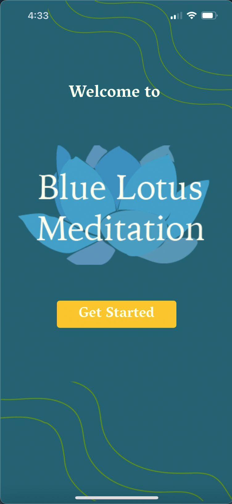
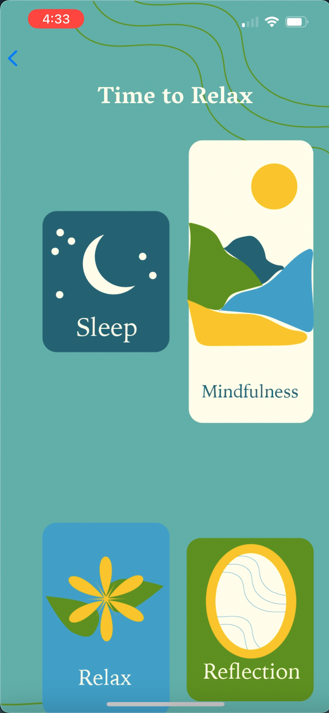
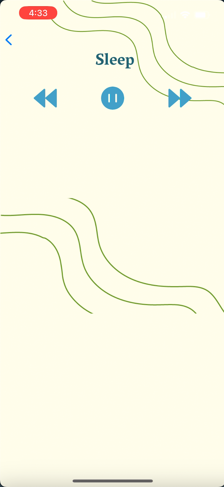

# Blue Lotus Meditation

This is a React Native app that was suppose to be a SIMPLE project to learn more about mobile app development. Currently audio player portion does not work, no matter what I try.

However, I did succeed in creating my first multi-page mobile app! 🎉

Here are what the app is suppose to look like:

